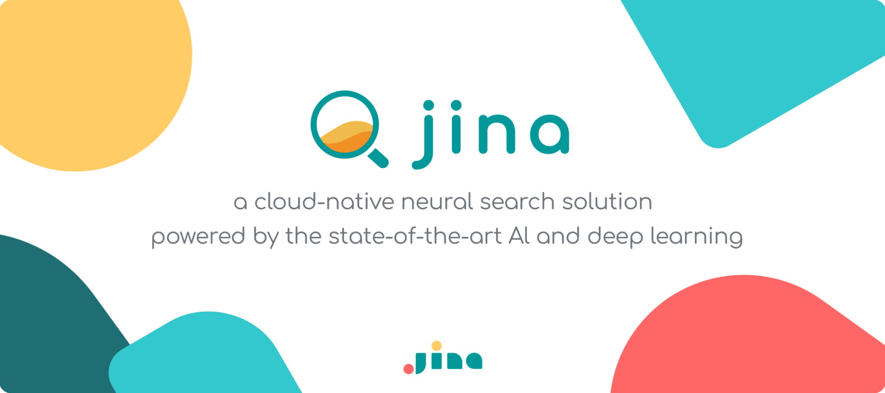
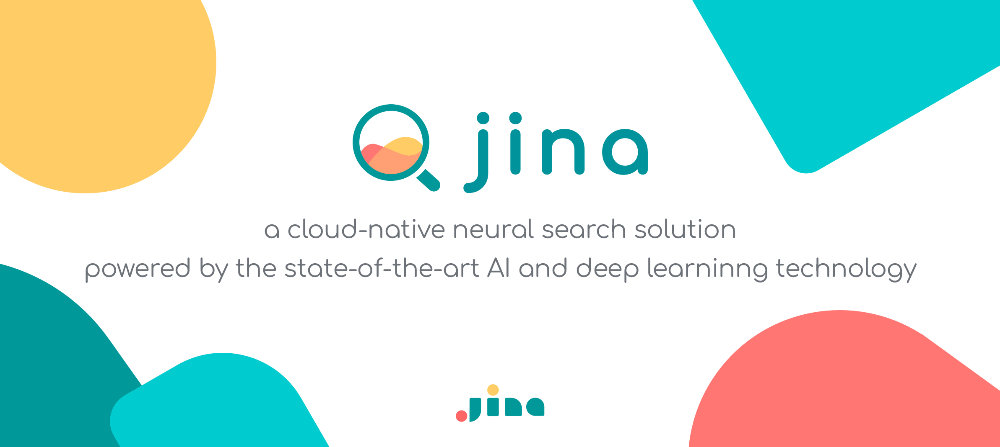
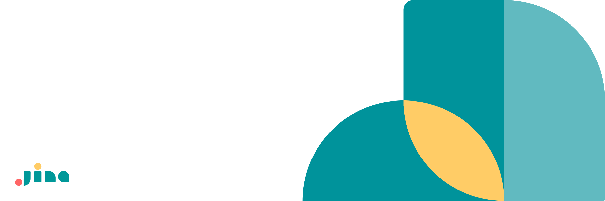
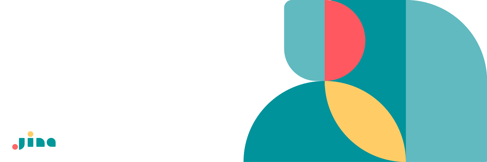
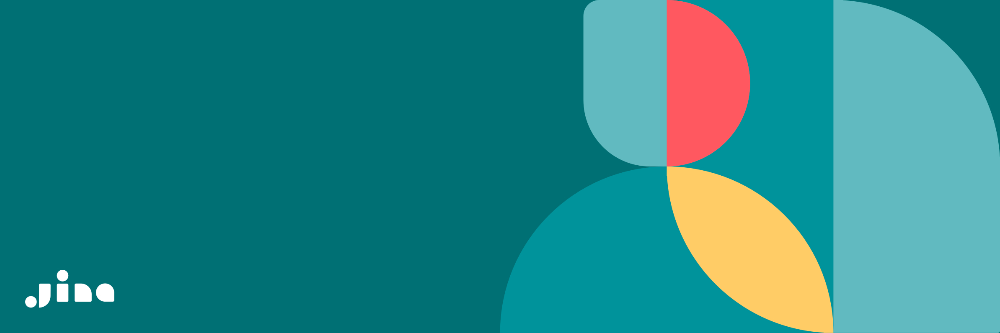
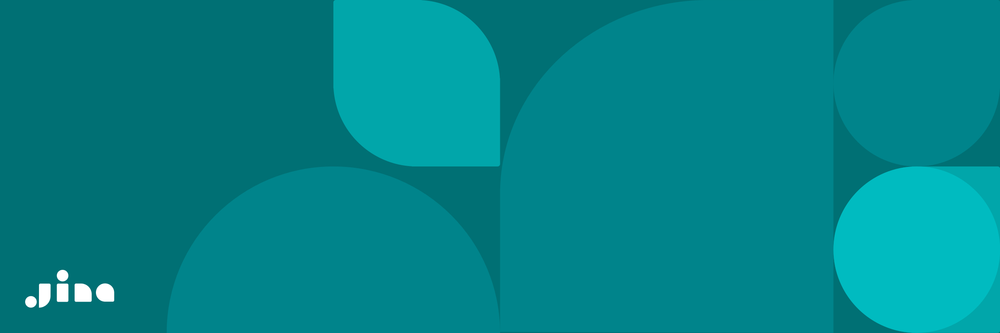
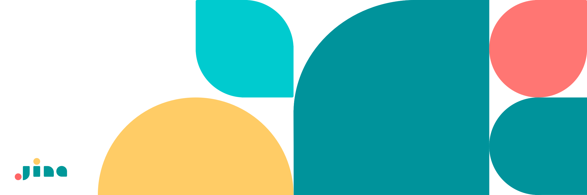

# Press Kit

Company info, visual branding, and color palette of Jina AI. You can use them in post, news, tweets, events.

## Company Info

Jina AI is a **Neural Search Company**, providing cloud-native neural search powered by state-of-the-art AI and deep learning. 
Our mission is to build an open-source neural search ecosystem for businesses and developers, enabling everyone to search for information in all kinds of data with high accessibility and scalability. 

- Name: Jina AI Limited (& Holdings)
- Founded in Feb., 2020 
- Type: Venture-backed, seed round is closed in Feb. 2020
- Offices: 
  - Beijing, China: Haidian District Haidian West street Nr. 48 Floor 5, 459 Room
  - Berlin, Germany: ℅ Techcode, Karl-Liebknecht-Str. 5, 10178

## Contact
- Contact: hello@jina.ai 
- Twitter: @JinaAI_ (with underscore at the end)
- Website: https://jina.ai 
- Github: https://opensource.jina.ai 
- Youtube: https://webinar.jina.ai 
- LinkedIn: https://www.linkedin.com/company/jinaai

## Company logo

Representing the group companies including Jina AI Limited (HK), Jina AI (Beijing) Limited , Beijing Jina Technology Limited, Jina AI GmbH. 

| | **With Tagline**| **No Tagline** |
|:---: | :---: | :---: |
| **Light background** |   |  |
| **Dark background** |  | |

## Product logo

We have a distinguishable logo that can be used to mark software built on top of Jina products.

### Jina (core)

Representing our opensource project Jina: https://github.com/jina-ai/jina/

| | **Horizontal** | **Vertical** | **No Tagline** |
| :---: | :---: | :---: | :---: |
| **Full color** |  | |  |
| **Dark background** |  |  |  |
| **Monotone** |  |  |  |

## Banner

The following banner images can be used in your blog post.

| Animated GIF |
| :---: |
||
| Static JPG/SVG|
| |
||
||
||
||
||
||
||
||

